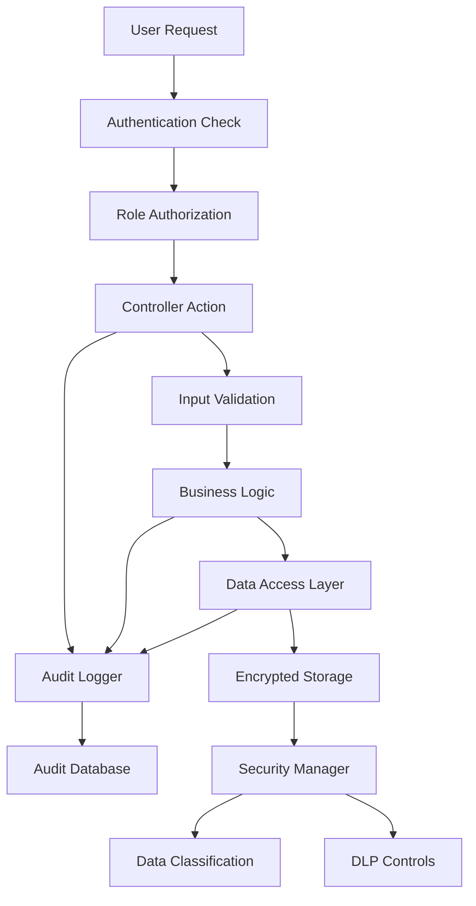
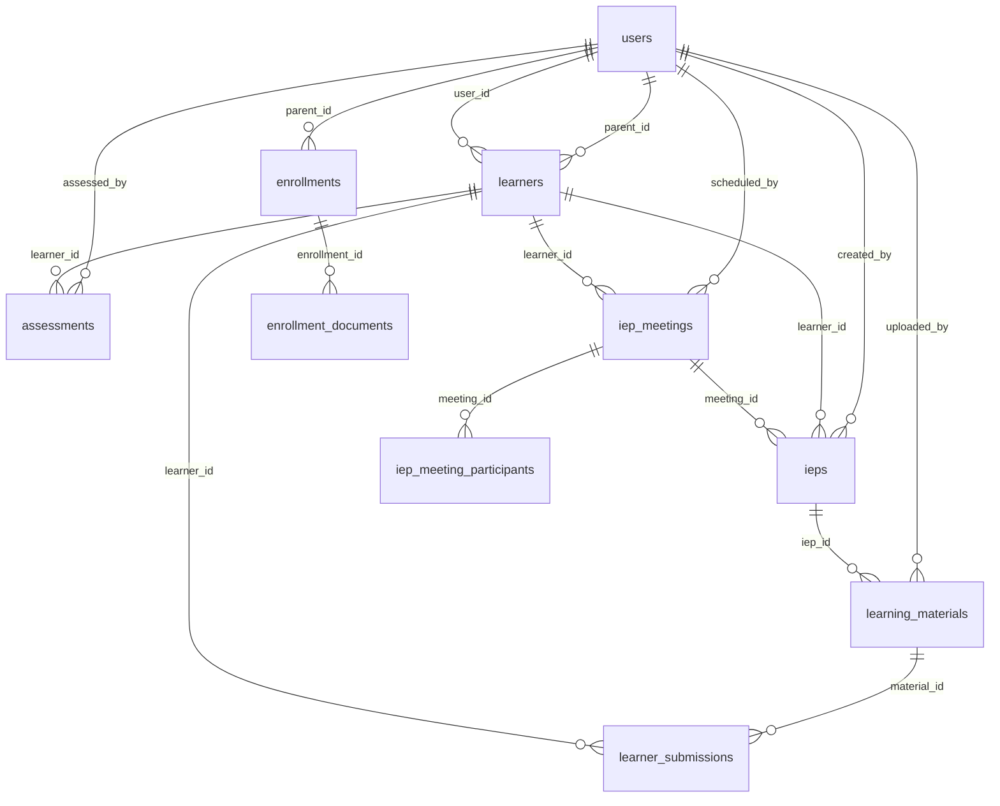

# Design Document: SPED Workflow Integration

## Overview

The SPED Workflow Integration feature extends the existing SignED PHP MVC application to support Special Education (SPED) management processes. The system implements seven core SPED workflow processes: enrollment document submission, verification, initial assessment, IEP meeting facilitation, IEP generation, implementation, and learner engagement tracking.

The design integrates seamlessly with the existing SignED architecture, extending the current user authentication system to support six user roles (Admin, SPED_Teacher, Parent, Guidance, Principal, Learner) and implementing role-based access control throughout the SPED workflow processes.

Key design principles include:
- **Security First**: AES-256 encryption for sensitive documents, comprehensive audit logging, and data loss prevention
- **Compliance**: WCAG 2.1 Level AA accessibility and educational data protection compliance
- **Integration**: Seamless extension of existing SignED MVC patterns and database schema
- **Scalability**: Support for 100+ concurrent users with optimized database queries and pagination

## Architecture

### System Architecture Overview

The SPED module follows the existing SignED MVC architecture pattern:

```
SignED Application
├── Core Framework (existing)
│   ├── App.php - URL routing and controller dispatch
│   ├── Controller.php - Base controller with auth/role methods
│   └── Model.php - Base model with database connection
├── SPED Module (new)
│   ├── Controllers
│   │   ├── SpedController.php - Main SPED workflow controller
│   │   ├── EnrollmentController.php - Document submission/verification
│   │   ├── AssessmentController.php - Initial assessments
│   │   ├── IepController.php - IEP meetings and generation
│   │   └── LearnerController.php - Learner engagement
│   ├── Models
│   │   ├── Learner.php - Learner data management
│   │   ├── Enrollment.php - Enrollment process management
│   │   ├── Assessment.php - Assessment data management
│   │   ├── IepMeeting.php - Meeting coordination
│   │   ├── Iep.php - IEP document management
│   │   ├── LearningMaterial.php - Material management
│   │   └── AuditLog.php - Audit logging
│   └── Views
│       ├── sped/ - SPED dashboard and navigation
│       ├── enrollment/ - Document submission/verification
│       ├── assessment/ - Assessment forms and results
│       ├── iep/ - IEP creation and approval
│       └── learner/ - Learner engagement interface
└── Security Layer (enhanced)
    ├── DocumentStore.php - Encrypted file storage
    ├── SecurityManager.php - Data classification and DLP
    └── NotificationService.php - Email notifications
```

### Component Integration

The SPED module integrates with existing SignED components:

1. **Authentication System**: Extends existing user roles and session management
2. **Database Layer**: Adds SPED-specific tables with foreign key relationships to existing users table
3. **Email System**: Leverages existing PHPMailer integration for notifications
4. **File Storage**: Implements encrypted document storage alongside existing file handling

### Security Architecture



## Components and Interfaces

### Core Controllers

#### SpedController
**Purpose**: Main dashboard and navigation for SPED workflows
**Methods**:
- `dashboard()` - Role-specific dashboard display
- `statistics()` - System statistics for admin users
- `navigation()` - Role-based menu generation

#### EnrollmentController
**Purpose**: Manages enrollment document submission and verification (Processes 1-2)
**Methods**:
- `submit()` - Parent document submission interface
- `upload()` - Handle document file uploads with validation
- `verify()` - SPED teacher/admin verification interface
- `approve($enrollmentId)` - Approve enrollment and create learner record
- `reject($enrollmentId)` - Reject enrollment with reason

#### AssessmentController
**Purpose**: Manages initial learner assessments (Process 3)
**Methods**:
- `list()` - Display learners ready for assessment
- `create($learnerId)` - Assessment form interface
- `save()` - Store assessment results
- `view($assessmentId)` - Display completed assessment

#### IepController
**Purpose**: Manages IEP meetings and document generation (Processes 4-5)
**Methods**:
- `scheduleMeeting($learnerId)` - Schedule IEP meeting
- `confirmAttendance($meetingId)` - Participant confirmation
- `recordMeeting($meetingId)` - Record meeting completion
- `createIep($learnerId)` - Generate IEP document
- `approve($iepId)` - Principal IEP approval
- `reject($iepId)` - Principal IEP rejection

#### LearnerController
**Purpose**: Manages IEP implementation and learner engagement (Processes 6-7)
**Methods**:
- `dashboard()` - Learner-specific dashboard
- `materials($learnerId)` - Display assigned learning materials
- `uploadMaterial($iepId)` - SPED teacher material upload
- `submitWork($materialId)` - Learner work submission
- `trackProgress($learnerId)` - Progress tracking interface

### Core Models

#### Learner Model
**Purpose**: Manages learner data and relationships
**Key Methods**:
- `create($enrollmentData)` - Create learner from approved enrollment
- `getByStatus($status)` - Retrieve learners by workflow status
- `updateStatus($learnerId, $status)` - Update learner workflow status
- `getWithAssessment($learnerId)` - Get learner with assessment data
- `getWithIep($learnerId)` - Get learner with IEP data

#### Enrollment Model
**Purpose**: Manages enrollment process and document tracking
**Key Methods**:
- `create($parentId, $learnerData)` - Create new enrollment
- `uploadDocument($enrollmentId, $documentType, $filePath)` - Store document reference
- `getByStatus($status)` - Get enrollments by verification status
- `updateStatus($enrollmentId, $status, $reason = null)` - Update enrollment status
- `getDocuments($enrollmentId)` - Retrieve all enrollment documents

#### Assessment Model
**Purpose**: Manages assessment data and results
**Key Methods**:
- `create($learnerId, $assessmentData)` - Store assessment results
- `getByLearner($learnerId)` - Retrieve learner's assessment
- `getForIepGeneration($learnerId)` - Get assessment data for IEP creation

#### IepMeeting Model
**Purpose**: Manages IEP meeting coordination
**Key Methods**:
- `schedule($learnerId, $dateTime, $participants)` - Schedule meeting
- `confirmParticipant($meetingId, $userId)` - Record attendance confirmation
- `recordCompletion($meetingId, $notes, $signatures)` - Record meeting completion
- `getByStatus($status)` - Get meetings by status

#### Iep Model
**Purpose**: Manages IEP document lifecycle
**Key Methods**:
- `create($learnerId, $assessmentData)` - Create IEP from assessment
- `save($iepId, $iepData)` - Save IEP draft
- `submitForApproval($iepId)` - Submit IEP for principal approval
- `approve($iepId, $principalId)` - Principal approval with signature
- `reject($iepId, $reason)` - Principal rejection with reason

#### LearningMaterial Model
**Purpose**: Manages learning materials and learner submissions
**Key Methods**:
- `upload($iepId, $objective, $filePath)` - Upload material for IEP objective
- `getByLearner($learnerId)` - Get materials assigned to learner
- `submitWork($materialId, $learnerId, $filePath)` - Record learner submission
- `getSubmissions($materialId)` - Get all submissions for material

### Security Components

#### DocumentStore Class
**Purpose**: Encrypted file storage and retrieval
**Key Methods**:
- `store($filePath, $classification)` - Encrypt and store file
- `retrieve($documentId, $userId)` - Decrypt and serve file with authorization
- `delete($documentId)` - Securely delete encrypted file
- `applyWatermark($filePath, $userInfo)` - Apply DLP watermark

#### SecurityManager Class
**Purpose**: Data classification and loss prevention
**Key Methods**:
- `classifyDocument($documentType)` - Assign security classification
- `enforceAccess($documentId, $userId, $action)` - Enforce access controls
- `logAccess($documentId, $userId, $action)` - Log document access
- `checkSessionTimeout()` - Enforce session timeout policies

#### AuditLog Model
**Purpose**: Comprehensive system activity logging
**Key Methods**:
- `logLogin($userId, $ipAddress, $success)` - Log authentication attempts
- `logDocumentAccess($userId, $documentId, $action)` - Log document operations
- `logStatusChange($userId, $entityType, $entityId, $oldStatus, $newStatus)` - Log workflow changes
- `logRoleChange($adminId, $targetUserId, $oldRole, $newRole)` - Log role modifications
- `query($filters)` - Query audit logs with filtering

### API Endpoints

All endpoints follow RESTful conventions and include role-based authorization:

#### Enrollment Endpoints
- `POST /enrollment/submit` - Submit enrollment documents (Parent)
- `POST /enrollment/upload` - Upload document file (Parent)
- `GET /enrollment/pending` - List pending verifications (SPED_Teacher, Admin)
- `POST /enrollment/approve/{id}` - Approve enrollment (SPED_Teacher, Admin)
- `POST /enrollment/reject/{id}` - Reject enrollment (SPED_Teacher, Admin)

#### Assessment Endpoints
- `GET /assessment/list` - List learners for assessment (SPED_Teacher)
- `GET /assessment/create/{learnerId}` - Assessment form (SPED_Teacher)
- `POST /assessment/save` - Save assessment results (SPED_Teacher)
- `GET /assessment/view/{id}` - View assessment (SPED_Teacher, Principal, Guidance)

#### IEP Endpoints
- `POST /iep/schedule-meeting` - Schedule IEP meeting (SPED_Teacher)
- `POST /iep/confirm-attendance/{meetingId}` - Confirm attendance (All participants)
- `POST /iep/record-meeting/{meetingId}` - Record meeting completion (SPED_Teacher)
- `GET /iep/create/{learnerId}` - IEP creation form (SPED_Teacher)
- `POST /iep/save` - Save IEP draft (SPED_Teacher)
- `POST /iep/submit/{id}` - Submit for approval (SPED_Teacher)
- `POST /iep/approve/{id}` - Approve IEP (Principal)
- `POST /iep/reject/{id}` - Reject IEP (Principal)

#### Learning Material Endpoints
- `POST /materials/upload` - Upload learning material (SPED_Teacher)
- `GET /materials/learner/{id}` - Get learner materials (Learner, SPED_Teacher)
- `POST /materials/submit-work` - Submit completed work (Learner)
- `GET /materials/submissions/{id}` - View submissions (SPED_Teacher)

## Data Models

### Database Schema Extensions

The SPED module extends the existing SignED database with the following tables:

#### Extended Users Table
```sql
-- Extend existing users table with new roles
ALTER TABLE users 
MODIFY COLUMN role ENUM('admin', 'teacher', 'parent', 'sped_teacher', 'guidance', 'principal', 'learner') NOT NULL;

-- Add SPED-specific user fields
ALTER TABLE users ADD COLUMN phone VARCHAR(20) NULL;
ALTER TABLE users ADD COLUMN address TEXT NULL;
ALTER TABLE users ADD COLUMN emergency_contact VARCHAR(100) NULL;
ALTER TABLE users ADD COLUMN emergency_phone VARCHAR(20) NULL;
```

#### Learners Table
```sql
CREATE TABLE learners (
    id INT AUTO_INCREMENT PRIMARY KEY,
    user_id INT NOT NULL,
    parent_id INT NOT NULL,
    first_name VARCHAR(50) NOT NULL,
    last_name VARCHAR(50) NOT NULL,
    date_of_birth DATE NOT NULL,
    grade_level VARCHAR(10) NOT NULL,
    disability_type VARCHAR(100) NULL,
    status ENUM('enrolled', 'assessment_pending', 'assessment_complete', 
                'iep_meeting_scheduled', 'iep_meeting_complete', 
                'iep_pending_approval', 'iep_approved', 'active') NOT NULL DEFAULT 'enrolled',
    created_at TIMESTAMP DEFAULT CURRENT_TIMESTAMP,
    updated_at TIMESTAMP DEFAULT CURRENT_TIMESTAMP ON UPDATE CURRENT_TIMESTAMP,
    FOREIGN KEY (user_id) REFERENCES users(id) ON DELETE CASCADE,
    FOREIGN KEY (parent_id) REFERENCES users(id) ON DELETE CASCADE,
    INDEX idx_status (status),
    INDEX idx_parent (parent_id)
);
```

#### Enrollments Table
```sql
CREATE TABLE enrollments (
    id INT AUTO_INCREMENT PRIMARY KEY,
    parent_id INT NOT NULL,
    learner_first_name VARCHAR(50) NOT NULL,
    learner_last_name VARCHAR(50) NOT NULL,
    learner_dob DATE NOT NULL,
    learner_grade VARCHAR(10) NOT NULL,
    status ENUM('pending_documents', 'pending_verification', 'approved', 'rejected') NOT NULL DEFAULT 'pending_documents',
    rejection_reason TEXT NULL,
    verified_by INT NULL,
    verified_at TIMESTAMP NULL,
    created_at TIMESTAMP DEFAULT CURRENT_TIMESTAMP,
    updated_at TIMESTAMP DEFAULT CURRENT_TIMESTAMP ON UPDATE CURRENT_TIMESTAMP,
    FOREIGN KEY (parent_id) REFERENCES users(id) ON DELETE CASCADE,
    FOREIGN KEY (verified_by) REFERENCES users(id) ON DELETE SET NULL,
    INDEX idx_status (status),
    INDEX idx_parent (parent_id)
);
```

#### Enrollment Documents Table
```sql
CREATE TABLE enrollment_documents (
    id INT AUTO_INCREMENT PRIMARY KEY,
    enrollment_id INT NOT NULL,
    document_type ENUM('psa', 'pwd_id', 'medical_record', 'beef') NOT NULL,
    original_filename VARCHAR(255) NOT NULL,
    encrypted_filename VARCHAR(255) NOT NULL,
    file_size INT NOT NULL,
    mime_type VARCHAR(100) NOT NULL,
    encryption_key_id VARCHAR(100) NOT NULL,
    uploaded_at TIMESTAMP DEFAULT CURRENT_TIMESTAMP,
    FOREIGN KEY (enrollment_id) REFERENCES enrollments(id) ON DELETE CASCADE,
    UNIQUE KEY unique_enrollment_document (enrollment_id, document_type),
    INDEX idx_enrollment (enrollment_id)
);
```

#### Assessments Table
```sql
CREATE TABLE assessments (
    id INT AUTO_INCREMENT PRIMARY KEY,
    learner_id INT NOT NULL,
    assessed_by INT NOT NULL,
    cognitive_ability TEXT NOT NULL,
    communication_skills TEXT NOT NULL,
    social_emotional_development TEXT NOT NULL,
    adaptive_behavior TEXT NOT NULL,
    academic_performance TEXT NOT NULL,
    recommendations TEXT NULL,
    assessment_date DATE NOT NULL,
    created_at TIMESTAMP DEFAULT CURRENT_TIMESTAMP,
    updated_at TIMESTAMP DEFAULT CURRENT_TIMESTAMP ON UPDATE CURRENT_TIMESTAMP,
    FOREIGN KEY (learner_id) REFERENCES learners(id) ON DELETE CASCADE,
    FOREIGN KEY (assessed_by) REFERENCES users(id) ON DELETE CASCADE,
    INDEX idx_learner (learner_id),
    INDEX idx_assessor (assessed_by)
);
```

#### IEP Meetings Table
```sql
CREATE TABLE iep_meetings (
    id INT AUTO_INCREMENT PRIMARY KEY,
    learner_id INT NOT NULL,
    scheduled_by INT NOT NULL,
    meeting_date DATETIME NOT NULL,
    location VARCHAR(255) NOT NULL,
    status ENUM('scheduled', 'confirmed', 'completed', 'cancelled') NOT NULL DEFAULT 'scheduled',
    meeting_notes TEXT NULL,
    completed_at TIMESTAMP NULL,
    created_at TIMESTAMP DEFAULT CURRENT_TIMESTAMP,
    updated_at TIMESTAMP DEFAULT CURRENT_TIMESTAMP ON UPDATE CURRENT_TIMESTAMP,
    FOREIGN KEY (learner_id) REFERENCES learners(id) ON DELETE CASCADE,
    FOREIGN KEY (scheduled_by) REFERENCES users(id) ON DELETE CASCADE,
    INDEX idx_learner (learner_id),
    INDEX idx_status (status),
    INDEX idx_meeting_date (meeting_date)
);
```

#### IEP Meeting Participants Table
```sql
CREATE TABLE iep_meeting_participants (
    id INT AUTO_INCREMENT PRIMARY KEY,
    meeting_id INT NOT NULL,
    user_id INT NOT NULL,
    role ENUM('sped_teacher', 'parent', 'guidance', 'principal', 'other') NOT NULL,
    attendance_status ENUM('invited', 'confirmed', 'declined', 'attended') NOT NULL DEFAULT 'invited',
    signature_data TEXT NULL,
    signed_at TIMESTAMP NULL,
    FOREIGN KEY (meeting_id) REFERENCES iep_meetings(id) ON DELETE CASCADE,
    FOREIGN KEY (user_id) REFERENCES users(id) ON DELETE CASCADE,
    UNIQUE KEY unique_meeting_participant (meeting_id, user_id),
    INDEX idx_meeting (meeting_id),
    INDEX idx_user (user_id)
);
```

#### IEPs Table
```sql
CREATE TABLE ieps (
    id INT AUTO_INCREMENT PRIMARY KEY,
    learner_id INT NOT NULL,
    created_by INT NOT NULL,
    meeting_id INT NULL,
    present_level_performance TEXT NOT NULL,
    annual_goals TEXT NOT NULL,
    short_term_objectives TEXT NOT NULL,
    special_education_services TEXT NOT NULL,
    accommodations TEXT NOT NULL,
    progress_measurement TEXT NOT NULL,
    start_date DATE NOT NULL,
    end_date DATE NOT NULL,
    status ENUM('draft', 'pending_approval', 'approved', 'rejected', 'active', 'expired') NOT NULL DEFAULT 'draft',
    approved_by INT NULL,
    approved_at TIMESTAMP NULL,
    rejection_reason TEXT NULL,
    digital_signature TEXT NULL,
    created_at TIMESTAMP DEFAULT CURRENT_TIMESTAMP,
    updated_at TIMESTAMP DEFAULT CURRENT_TIMESTAMP ON UPDATE CURRENT_TIMESTAMP,
    FOREIGN KEY (learner_id) REFERENCES learners(id) ON DELETE CASCADE,
    FOREIGN KEY (created_by) REFERENCES users(id) ON DELETE CASCADE,
    FOREIGN KEY (meeting_id) REFERENCES iep_meetings(id) ON DELETE SET NULL,
    FOREIGN KEY (approved_by) REFERENCES users(id) ON DELETE SET NULL,
    INDEX idx_learner (learner_id),
    INDEX idx_status (status),
    INDEX idx_creator (created_by)
);
```

#### Learning Materials Table
```sql
CREATE TABLE learning_materials (
    id INT AUTO_INCREMENT PRIMARY KEY,
    iep_id INT NOT NULL,
    uploaded_by INT NOT NULL,
    title VARCHAR(255) NOT NULL,
    description TEXT NULL,
    iep_objective TEXT NOT NULL,
    original_filename VARCHAR(255) NOT NULL,
    encrypted_filename VARCHAR(255) NOT NULL,
    file_size INT NOT NULL,
    mime_type VARCHAR(100) NOT NULL,
    encryption_key_id VARCHAR(100) NOT NULL,
    due_date DATE NULL,
    created_at TIMESTAMP DEFAULT CURRENT_TIMESTAMP,
    FOREIGN KEY (iep_id) REFERENCES ieps(id) ON DELETE CASCADE,
    FOREIGN KEY (uploaded_by) REFERENCES users(id) ON DELETE CASCADE,
    INDEX idx_iep (iep_id),
    INDEX idx_uploader (uploaded_by)
);
```

#### Learner Submissions Table
```sql
CREATE TABLE learner_submissions (
    id INT AUTO_INCREMENT PRIMARY KEY,
    material_id INT NOT NULL,
    learner_id INT NOT NULL,
    original_filename VARCHAR(255) NOT NULL,
    encrypted_filename VARCHAR(255) NOT NULL,
    file_size INT NOT NULL,
    mime_type VARCHAR(100) NOT NULL,
    encryption_key_id VARCHAR(100) NOT NULL,
    submission_notes TEXT NULL,
    submitted_at TIMESTAMP DEFAULT CURRENT_TIMESTAMP,
    reviewed_by INT NULL,
    review_notes TEXT NULL,
    reviewed_at TIMESTAMP NULL,
    FOREIGN KEY (material_id) REFERENCES learning_materials(id) ON DELETE CASCADE,
    FOREIGN KEY (learner_id) REFERENCES learners(id) ON DELETE CASCADE,
    FOREIGN KEY (reviewed_by) REFERENCES users(id) ON DELETE SET NULL,
    INDEX idx_material (material_id),
    INDEX idx_learner (learner_id),
    INDEX idx_submitted (submitted_at)
);
```

#### Audit Logs Table
```sql
CREATE TABLE audit_logs (
    id BIGINT AUTO_INCREMENT PRIMARY KEY,
    user_id INT NULL,
    action_type ENUM('login', 'logout', 'document_access', 'document_upload', 
                     'status_change', 'role_change', 'approval', 'rejection', 
                     'meeting_schedule', 'email_sent', 'error') NOT NULL,
    entity_type ENUM('user', 'learner', 'enrollment', 'assessment', 'iep_meeting', 
                     'iep', 'learning_material', 'submission') NULL,
    entity_id INT NULL,
    old_value TEXT NULL,
    new_value TEXT NULL,
    ip_address VARCHAR(45) NULL,
    user_agent TEXT NULL,
    additional_data JSON NULL,
    created_at TIMESTAMP DEFAULT CURRENT_TIMESTAMP,
    FOREIGN KEY (user_id) REFERENCES users(id) ON DELETE SET NULL,
    INDEX idx_user (user_id),
    INDEX idx_action_type (action_type),
    INDEX idx_entity (entity_type, entity_id),
    INDEX idx_created_at (created_at)
);
```

#### Error Logs Table
```sql
CREATE TABLE error_logs (
    id BIGINT AUTO_INCREMENT PRIMARY KEY,
    user_id INT NULL,
    error_type ENUM('file_upload', 'database', 'email', 'encryption', 'validation', 'system') NOT NULL,
    severity ENUM('low', 'medium', 'high', 'critical') NOT NULL,
    error_message TEXT NOT NULL,
    stack_trace TEXT NULL,
    request_data JSON NULL,
    ip_address VARCHAR(45) NULL,
    user_agent TEXT NULL,
    created_at TIMESTAMP DEFAULT CURRENT_TIMESTAMP,
    FOREIGN KEY (user_id) REFERENCES users(id) ON DELETE SET NULL,
    INDEX idx_user (user_id),
    INDEX idx_error_type (error_type),
    INDEX idx_severity (severity),
    INDEX idx_created_at (created_at)
);
```

### Data Relationships



## Correctness Properties

*A property is a characteristic or behavior that should hold true across all valid executions of a system-essentially, a formal statement about what the system should do. Properties serve as the bridge between human-readable specifications and machine-verifiable correctness guarantees.*

Based on the prework analysis, I'll now perform property reflection to eliminate redundancy:

**Property Reflection:**
- Properties 3.1, 8.1, and 9.1 all test file type validation but for different contexts - these can be combined into one comprehensive file validation property
- Properties 10.1 and 10.2 test encryption/decryption - these form a natural round-trip property
- Properties 11.1 and 11.2 both test audit logging - these can be combined into one comprehensive logging property
- Properties 1.1, 2.1, 2.2 test role-based access - these can be combined into one comprehensive authorization property
- Properties 4.1 and 5.1 both test status-based filtering - these can be combined into one filtering property

### Property 1: Role-based Registration and Authorization

*For any* user registration attempt with a valid role (Admin, SPED_Teacher, Parent, Guidance, Principal, Learner), the system SHALL successfully create the user account and enforce role-based access control for all subsequent controller actions

**Validates: Requirements 1.1, 2.1, 2.2, 2.3**

### Property 2: Password Security Policy

*For any* password input during registration, the system SHALL enforce the security policy (minimum 8 characters, uppercase, lowercase, number, special character) and store valid passwords as bcrypt or argon2 hashes, never as plaintext

**Validates: Requirements 1.2, 1.3**

### Property 3: Authentication Round-trip

*For any* valid user account, successful authentication SHALL create a session with correct user_id and role, and subsequent login attempts with correct credentials SHALL always succeed while incorrect credentials SHALL always fail

**Validates: Requirements 1.4, 1.5**

### Property 4: File Upload Validation

*For any* file upload attempt (enrollment documents, learning materials, or learner submissions), the system SHALL validate file type against the allowed extensions for that context and reject files exceeding the size limit

**Validates: Requirements 3.1, 3.2, 8.1, 9.1**

### Property 5: Document Encryption Round-trip

*For any* uploaded document, the system SHALL encrypt it using AES-256 before storage, and authorized retrieval SHALL decrypt the document preserving the original content exactly

**Validates: Requirements 10.1, 10.2**

### Property 6: Enrollment Completion Logic

*For any* enrollment submission, the system SHALL require all four document types (PSA, PWD_ID, Medical_Record, BEEF) before changing status to "Pending Verification", and incomplete submissions SHALL remain in "pending_documents" status

**Validates: Requirements 3.3, 3.4**

### Property 7: Status-based Filtering

*For any* interface that displays records by status (verification interface, assessment interface), the system SHALL display only records matching the required status and exclude all others

**Validates: Requirements 4.1, 5.1**

### Property 8: Form Validation Completeness

*For any* form submission (assessment, IEP meeting scheduling, IEP creation), the system SHALL validate all required fields are present and sanitize all text inputs to remove malicious content

**Validates: Requirements 5.3, 6.1, 16.1, 16.2**

### Property 9: Assessment Data Propagation

*For any* IEP creation based on an assessment record, the system SHALL pre-populate IEP fields with the correct assessment data, maintaining data integrity across the workflow

**Validates: Requirements 7.1**

### Property 10: Comprehensive Audit Logging

*For any* system action (login attempts, document access, status changes, role modifications), the system SHALL record the action in the audit log with all required fields (timestamp, user_id, action details) and use parameterized SQL queries to prevent injection

**Validates: Requirements 11.1, 11.2, 16.3**

## Error Handling

### File Upload Error Handling

**Upload Validation Errors**:
- Invalid file type: Return specific error message listing allowed file types
- File size exceeded: Return error message with size limit information
- Malware detection: Quarantine file and log security incident
- Storage failure: Log error and provide user-friendly message

**Error Recovery**:
- Failed uploads allow immediate retry without losing form data
- Partial enrollment submissions are saved and can be resumed
- Temporary files are cleaned up after failed uploads

### Database Error Handling

**Connection Errors**:
- Database unavailable: Display maintenance message and log critical error
- Query timeout: Retry operation once, then fail gracefully
- Constraint violations: Return specific validation error messages

**Data Integrity**:
- Foreign key violations: Prevent orphaned records with proper error messages
- Duplicate submissions: Detect and prevent duplicate enrollments/assessments
- Concurrent modifications: Use optimistic locking for IEP updates

### Authentication and Authorization Errors

**Authentication Failures**:
- Invalid credentials: Generic error message to prevent user enumeration
- Account lockout: Clear message with lockout duration
- Session timeout: Redirect to login with session expired message

**Authorization Failures**:
- Insufficient permissions: Role-specific error message
- Resource not found: Generic 404 error to prevent information disclosure
- Expired sessions: Automatic redirect to login page

### Email Notification Errors

**SMTP Failures**:
- Connection timeout: Retry up to 3 times with exponential backoff
- Authentication failure: Log error and alert administrator
- Recipient invalid: Log error but continue processing

**Notification Recovery**:
- Failed notifications are queued for retry
- Critical notifications (IEP approvals) trigger alternative notification methods
- Email delivery status is tracked in audit logs

### Encryption and Security Errors

**Encryption Failures**:
- Key generation failure: Log critical error and prevent document storage
- Encryption process failure: Quarantine document and alert administrator
- Decryption failure: Log security incident and deny access

**Security Violations**:
- Multiple failed login attempts: Implement progressive delays
- Suspicious file uploads: Quarantine and alert security team
- Data access violations: Log incident and notify administrator

## Testing Strategy

### Dual Testing Approach

The SPED Workflow Integration feature requires both unit tests and property-based tests for comprehensive coverage:

**Unit Tests** focus on:
- Specific examples of workflow processes (enrollment approval, IEP creation)
- Integration points with existing SignED components
- Edge cases and error conditions (session timeouts, email failures)
- UI component behavior and form validation

**Property-Based Tests** focus on:
- Universal properties that hold across all inputs (file validation, encryption round-trips)
- Security properties (authentication, authorization, audit logging)
- Data integrity properties (status transitions, form validation)
- Comprehensive input coverage through randomization

### Property-Based Testing Configuration

**Framework**: PHPUnit with Eris (PHP property-based testing library)
**Test Configuration**:
- Minimum 100 iterations per property test
- Custom generators for SPED-specific data types (roles, document types, statuses)
- Shrinking enabled to find minimal failing examples

**Property Test Implementation**:
Each correctness property will be implemented as a property-based test with the following tag format:
```php
/**
 * @test
 * Feature: sped-workflow-integration, Property 1: Role-based Registration and Authorization
 */
```

### Unit Test Coverage

**Controller Tests**:
- EnrollmentController: Document submission workflow, verification process
- AssessmentController: Assessment form handling, data validation
- IepController: Meeting scheduling, IEP approval workflow
- LearnerController: Material access, submission handling

**Model Tests**:
- User role extensions and authentication integration
- Document encryption/decryption with DocumentStore
- Audit logging for all SPED operations
- Email notification integration with PHPMailer

**Integration Tests**:
- Database schema integration with existing SignED tables
- File storage integration with encrypted document handling
- Email system integration for workflow notifications
- Session management integration with existing authentication

### Security Testing

**Penetration Testing**:
- SQL injection attempts on all database operations
- File upload security (malware, path traversal, type confusion)
- Authentication bypass attempts
- Authorization escalation testing

**Compliance Testing**:
- WCAG 2.1 Level AA accessibility validation
- Data protection compliance verification
- Audit log completeness and retention testing
- Encryption strength validation (AES-256)

### Performance Testing

**Load Testing**:
- 100 concurrent users performing typical workflows
- Document upload performance with 5MB files
- Database query performance with 10,000+ records
- Email notification system under load

**Scalability Testing**:
- Response time validation under increasing load
- Memory usage monitoring during file operations
- Database connection pool management
- Session storage scalability

### Test Data Management

**Test Data Generation**:
- Realistic learner and enrollment data
- Various document types and sizes for upload testing
- Multiple user roles and permission scenarios
- Historical data for audit log testing

**Data Privacy**:
- No real PII in test data
- Synthetic data generation for realistic testing
- Secure cleanup of test files and database records
- Compliance with data protection requirements during testing

### Continuous Integration

**Automated Testing Pipeline**:
- Unit tests run on every commit
- Property-based tests run on pull requests
- Integration tests run on staging deployment
- Security scans run weekly

**Test Reporting**:
- Coverage reports for unit and property tests
- Performance benchmarks tracked over time
- Security scan results with vulnerability tracking
- Accessibility compliance validation results